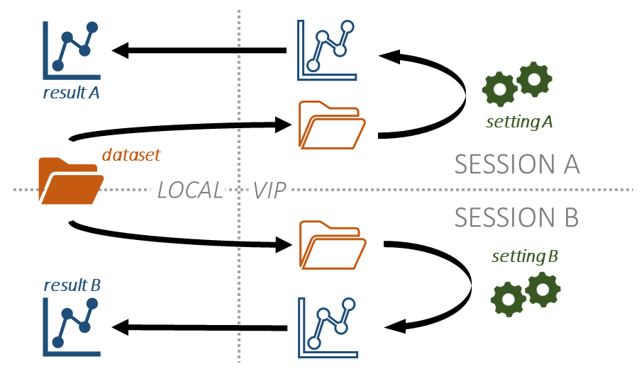
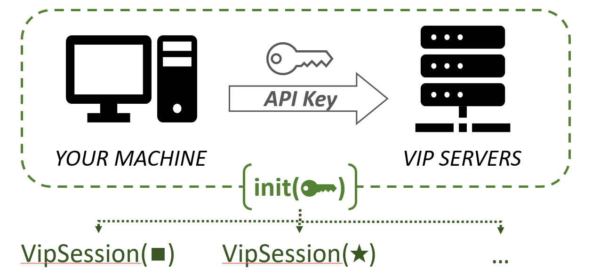

# Table of Contents

[VIP Python Client](#vip-python-client)

[VipSession](#vipsession)
- [Introduction](#introduction)
    - [Main Goal](#main-goal)
    - [Prerequisites](#prerequisites)
- [Get Started](#get-started)
    - [Session Inputs](#session-inputs)
    - [Basic Steps](#basic-steps)
    - [Session Outputs](#session-outputs)
- [Best Practices](#best-practices)
    - [Use Session Shortcuts](#use-session-shortcuts)
    - [Resume your Session](#resume-your-session)
    - [Parallelize your Pipeline Runs with VIP](#parallelize-your-pipeline-runs-with-vip)
    - [Run Two Sessions on the Same Dataset](#run-multiple-sessions-on-the-same-dataset)

[Get a VIP API key](#get-a-vip-api-key)

# VIP-python-client

This module is used to communicate with the VIP api using the Python
language.
This a synchronous implementation.

## How to use it

This module works like a state-machine : first, set the apikey with
setApiKey(str). All the functions will refer to this apikey later.

You can also set the certificate for vip with setCertifPath(str). By default,
the script will look at its location for a '[...]/certif.crt' file.
You should already have a certificate when cloning this project from git. If
it's not the case you can get it with your browser [on VIP](http://vip.creatis.insa-lyon.fr/). Get the chained one.

You can now use all of the functions :)

## Raised errors

If there's any VIP issues, functions will raise *RuntimeError* errors. See
'detect\_errors' and 'manage\_errors' functions if you want to change this.

## Improvement

- an asynchronous version
- missing a few optional parameters for some function (not important)


# VipSession

[vip-portal]: https://vip.creatis.insa-lyon.fr/ "https://vip.creatis.insa-lyon.fr/"

*Python client for the VIP API.*

## Introduction

### Main Goal

This Python class launches pipeline executions on the Virtual Imaging Platform (VIP) from one's personal computer. It should work on both Windows and Unix-based systems.

Running a pipeline on VIP implies the folowing process: 

*Upload one's Dataset on VIP servers* **>>** *Run the Pipeline* **>>** *Download the Pipeline Results from VIP servers*.

This is summarized in the diagram below.


A VipSession instance (hereafter named: *Session*) performs this procedure in a few simple steps.

### Prerequisites

- VipSession uses the [VIP API](./vip.py), making calls to [Python's Request Library](https://pypi.org/project/requests/). This may require installing this library on your computer:
```
pip install requests
```

- Communication with VIP requires a valid API key. 
See [below](#get-a-vip-api-key) how to get your own key in a few steps.

## Get Started

### Session Inputs

A single Session allows you to run __1 pipeline__ on __1 dataset__ with __1 parameter set__. 
Therefore, a Session is defined with at least three inputs:

1. `pipeline_id` (*str*, **required**): The name of your pipeline on VIP. 
    - *Usually in format : *application_name*/*version**.
2. `input_dir` (*str*, **required**): the local path to your dataset (*e.g.* '$HOME/project/data').
    - *This directory will be uploaded on VIP before launching the pipeline.*
3. `input_settings` (*dict*, **required**) All parameters needed to run the pipeline.
    - *See pipeline description for more information*.

When a Session is created, two optional inputs can be provided to improve user experience:

4. `session_name` (*str*, **optional**) A name to identify this session and the corresponding results. 
    - *Default value: 'session_[date]_[time]'*
5. `output_dir` (*str*, **optional**) Local path to the directory where pipeline outputs will be downloaded from VIP servers.
    - *Default value: './vip_outputs/`session_name`'*

Inputs 4 & 5 should be unique: they cannot be shared with another Session. Inputs 1 to 5 are a Sessions' main **properties**: they fully define its behaviour throughout the Upload-Run-Download procedure.

In addition, VipSession methods accept specific arguments (like `verbose` or `nb_runs`) to fine-tune their behaviour. 
See VipSession documentation for detailed information. 

Finally, connection with VIP requires a valid [API key](#get-a-vip-api-key). 
This requirement is not bound to a given Session.

0. `api_key` (*str*, **required**): your VIP API key.
    - *The string value can take several forms. See `VipSession.init()` for detailed information.*

### Basic Steps

Once connection with VIP is established (*stage 0*), the Upload-Run-Download procedure is achieved through six elementary steps:

**1- Start** a Session >> **2- Upload** the Inputs >> **3- Launch** the Pipeline >> **4- Monitor** Pipeline's Workflows >> **5- Download** the Outputs >> **6- Finish** the Session by removing your data from VIP servers.

Each step has a dedicated method.
```python
from utils.VipSession import VipSession

# 0. Connect with VIP
VipSession.init(api_key=...)  
# One call applies to multiple Sessions (until connection is lost).

# 1. Create a Session
session = VipSession(session_name=...)
# 2. Upload your data on VIP servers
session.upload_inputs(input_dir=...)
# 3. Launch a pipeline on VIP
session.launch_pipeline(pipeline_id=..., input_settings=...)
# 4. Monitor its progress on VIP until all executions are over 
session.monitor_workflows()
# 5. Download the outputs from VIP servers when all executions are over
session.download_outputs()
# 6. Remove the data from VIP servers (inputs and outputs)
session.finish()
```

In this typical piece of code, `session`'s [properties](#session-inputs "VipSession Inputs") (`session_name`, `input_dir`, *etc.*) are progressively passed as inputs during steps 1, 2 & 3. They can also be defined at instantiation (i.e., step 1 or even step 0: see [below](#use-session-shortcuts "Session Shortcuts")). Once set, a property cannot be modified. 

### Session Outputs

When running a Session for the first time, a directory (`output_dir`) is made to store the pipeline results and the Session backup file.
By default, this `output_dir` is: *./vip_outputs/`session_name`* .

#### Session Backup
At the end of steps 2, 3, 4, 5 & 6, session properties (*e.g.*, `session_name`, `pipeline_id`) are automatically saved in a JSON file (*session_data.json*).
This backup can be used to [resume a finished or running Session][resume].

[resume]: #resume-your-session "Resume your Session"

#### Pipeline Results
The `download_outputs()` procedure stores the pipeline results on your machine. If the VIP implementation of the pipeline yields a tarball (*\*.tar.gz*), its content is extracted (by default) and the archive is removed from your machine.

When a single job\* is submitted to VIP, the pipeline results are stored in `output_dir` mirroring their structure on VIP servers: 

```
.
├── 02-02-2023_09:21:23
│   └── results.tgz
│       ├── file_x
│       └── file_y
└── session_data.json
```

In this file tree:
- Pipeline results correspond to *file_x* & *file_y*.
- *results.tgz* gathers the job's results (\*).
    - If the VIP implementation the pipeline yields a tarball, results.tgz is a folder bearing the same name.
- *02-02-2023_09:21:23* is named after the starting time of the workflow (\*).

(\*) See [below](#jobs-and-workflows "Jobs and Workflows") for detailed information about jobs and workflows.

## Best Practices

[steps]: #basic-steps "Basic Steps"

### Use Session Shortcuts

Session properties can be declared at instantiation:
```python
session = VipSession(session_name=..., input_dir=..., pipeline_id=..., input_settings=..., ouput_dir=...)
```

This can be combined with VIP connection ([steps 0 & 1][steps]) through `VipSession.init()`:
```python
session = VipSession.init(api_key=..., session_name=..., input_dir=..., [...])
```

Once connection is established and Session inputs are set, 
the **upload-run-download** process ([steps 2->5][steps]) can be performed by `run_session()`:
```python
session.run_session()
```

Do not forget to remove your data from VIP servers once the download is complete:
```python
session.finish()
```

All methods can be run in cascade, so the whole procedure holds on a single line :
```python
VipSession.init(api_key=..., input_dir=..., [...]).run_session().finish()
```

### Resume your Session

A Session is backed up after every step. 
To load data from an old Session, instanciate it with its output directory (`ouput_dir`):
```python
session = VipSession(output_dir='./vip_outputs/old_session')
```
If `ouput_dir` is default (like above), **simply provide the `session_name`**:
```python
session = VipSession('old_session') # Equivalent to: session = VipSession(session_name='old_session')
```

This backup/restore system is useful to:
- [Run the *Upload-Run-Download* process intermittently][progress], without a dedicated variable ; 
- [Relaunch the same procedure][finished], after the Session has been "finished".

[progress]: #resume-a-session-in-progress "Resume a Session in Progress"
[finished]: #relaunch-a-finished-session "Relaunch a Finished Session"

#### Resume a Session in Progress

For instance, some pipeline runs can take hours or days. 
These runs should be monitored on the [VIP portal](vip-portal) while turning off your Python interpeter. 
Using an identifiable `session_name`, the procedure can be left any time and resumed with an identical Session object.
```python
# Connect with VIP
VipSession.init(api_key=...)
# Start a Session with a new name and upload your dataset
VipSession("my_session").upload_inputs(input_dir=...)
# When the upload is over, launch the pipeline 
VipSession("my_session").launch_pipeline(pipeline_id=..., input_settings=...)
# 
# You can exit your Python interpreter and monitor the pipeline execution on VIP website.
# 
# When the execution is over, connect with VIP again and download the outputs
VipSession.init(api_key=..., session_name="my_session").download_ouputs()
# When the download is over, remove your data from VIP servers
VipSession("my_session").finish()
```
Unlike our [first examples][get-started], here the Session is run without a dedicated variable by using the session name: `VipSession("my_session")`.
This is possible because a personalized `session_name` was set, but no personnalized `output_dir`. If for some reason a personnalized `output_dir` is set, the session can be resumed only by typing: `VipSession(output_dir=...)`.

[get-started]: #get-started "Get Started"

#### Relaunch a Finished Session

Finally, a Session can also be resumed after running the `finish()` method.
For example, to dispay a short report about your pipeline runs:
```python
VipSession("my_session").monitor_workflows()
```

The same Session can be used to relaunch a full *Upload-Run-Download* procedure with the same inputs:
```python
# Connect with VIP
VipSession.init(api_key=...)
# Relaunch the full procedure & finish
VipSession("my_session").run_session().finish()
```

In that case, the new pipeline outputs will be downloaded next to the older ones.

This feature can be used to run repeatability experiments on one's successful pipeline executions.

### Parallelize your Pipeline Runs with VIP

#### Illustration

In a Session's output directory (`output_dir`), the file tree presented [above](#pipeline-results "Pipeline Results") can be generalized as below:
```
.
├── Workflow_1
│   ├── Job_A
│   │   ├── file_x
│   │   └── file_y
│   └── Job_B
│       ├── file_x
│       └── file_y
├── Workflow_2
│   ├── Job_A
│   │   ├── file_x
... ... ...
└── session_data.json
```

#### Jobs and Workflows

In this file tree:
- Pipeline results correspond to *file_x*, *file_y*;
- *Job_A* gathers the results of a single pipeline run;
- *Workflow_1* gathers the results of multiple jobs.

A **job** is a single task run by the pipeline on VIP, *e.g.* with a single input file and parameter set.
One can submit multiple jobs in parallel, *e.g.* run the pipeline on multiple files and parameter sets at the same time. 
This can be achieved by providing *lists* of files or parameters in the `input_settings`.

From a Session's point of view, a **workflow** is a collection of jobs submitted on the same `pipeline_id` with the same `input_settings`. 
Again, one Session can launch multiple workflows (\*); either by calling `launch_pipeline()` several times, or by increasing its optional argument `nb_runs`, or by [re-starting the session](#relaunch-a-finished-session) after it was "finished". Multiple workflows can also run in parallel on VIP.

(\*) To run simultaneous workflows with your VIP account, please contact <vip-support@creatis.insa-lyon.fr> to increase your execution capacity (1 by default).*

#### In a Nusthell

VIP pipelines can be run on massive datasets by submitting jobs in parallel.
- A **single job** is submitted on VIP when `launch_pipeline()` is called and `input_settings` are filled with a single value for each parameter;
- A **single workflow** can be used to run **multiple jobs** in parallel, by providing a list of values for some parameters in the `input_settings`;
- A **single Session** can be used to run **multiple workflows** in parallel, on the same `pipeline_id` with the same `input_settings`;
- **Multiple Sessions** can be used to run **multiple workflows** in parallel, with multiple `pipeline_id` and `input_settings`.

Clever use of multiple Sessions in parallel is detailed below.

### Run Multiple Sessions on the Same Dataset

As stated [above][get-started], 1 Session allows to run 1 pipeline on 1 dataset with 1 parameter set. 
To run a pipeline with *several parameter sets*, or *several pipelines* on the same dataset, one has to start several sessions:
```python
# Session Inputs
my_dataset = "./data" 
settings_A = ... # First parameter set
settings_B = ... # Second parameter set
# Connect to VIP
VipSession.init(api_key=...)
# Run Session A with settings A and finish
session_a = VipSession(input_dir=my_dataset, pipeline_id=..., input_settings=settings_A
).run_session().finish()
# Run Session B with settings B and finish
session_b = VipSession(input_dir=my_dataset, pipeline_id=..., input_settings=settings_B
).run_session().finish()
```

By default, **each dataset uploaded on VIP is bound to a single Session**. In the above example, `my_dataset` is thus **uploaded twice** on VIP servers (and removed twice at the end), as depicted in the diagram below.



Unlike the previous example, **using `get_inputs()` allows a Session to reuse the inputs of another**:
```python
session_b.get_inputs(session_a)
```

`get_inputs()` is meant to replace `upload_inputs()` during [Step 2][steps] of the *Upload-Run-Download* procedure. Bearing this in mind, the previous example could be rewritten this way:

```python
# Run Session A
session_a = VipSession(input_dir=my_dataset, pipeline_id=..., input_settings=settings_A
).run_session() # Do not run `finish()` until the entire process is over.
# Create Session B using the same inputs as Session A
session_b = VipSession(pipeline_id=..., input_settings=settings_B)
session_b.get_inputs(session_a)
# Run Session B and finish
session_b.run_session().finish()
# Finish Session A
session_a.finish()
```

By default, running `finish()` on Session B will not remove its inputs (i.e., `my_dataset`) from VIP servers, because they belong to Session A (see the diagram below). This behaviour can be can be modified by setting `force_remove`=True.


Besides saving memory on VIP servers, **clever use of input data can save a lot of time**, since there is no easy way to parallelize the upload and download steps between multiple sessions.

---

# Get a VIP API key

One can easily create a VIP account to generate one's own API key : the procedure is summarized in the image below.



*Useful tips*
- On **Step 3**, the user is asked to select an *Account Type*. This can be modified later: select only the entries relevant to your research area.
- On **Step 6**, scroll down to the bottom of the page. 

If you encounter any issues, please contact us:
<vip-support@creatis.insa-lyon.fr>
