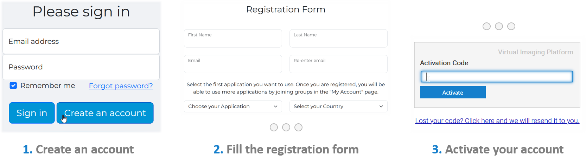

[vip-portal]: https://vip.creatis.insa-lyon.fr/ "https://vip.creatis.insa-lyon.fr/"

# Manage your VIP Account

This doc page is for VIP beginners. 
It explains [how to create a VIP account](#create-a-vip-account) 
and [how to get a VIP API key](#get-a-vip-api-key).
If you encounter any issues, please contact us at: <vip-support@creatis.insa-lyon.fr>.

- [Create a VIP account](#create-a-vip-account)
  - [Procedure](#procedure)
  - [Join a New Group](#join-a-new-group)
- [Get a VIP API key](#get-a-vip-api-key)
  - [Find your API key](#find-your-api-key)
  - [Hide your API key](#hide-your-api-key)

---

## Create a VIP account

### Procedure

The registration procedure takes a couple of minutes on the [**VIP Portal**][vip-portal] (*https://vip.creatis.insa-lyon.fr/*).
It is summarized in the diagram below.



During **Step 2**, the user may be asked to select one or several applications they intend to use. This ensures they are registered in an application *group* when using VIP for the first time. 

### Join a New Group

Running a given application on VIP (in the Python client: `pipeline_id`) requires belonging to its application *group*. You can join (and leave) any group at any time from the [VIP portal][vip-portal], following 4 simple steps.


## Get a VIP API key

[python-client]: https://github.com/virtual-imaging-platform/VIP-python-client "VIP-python-client"

A valid API key is required to run the VIP [Python client][python-client].

### Find your API key

Once your VIP account is set up, the API key can be generated in two steps. The procedure is summarized in the image below.


_Your VIP API key **must be kept private**. Please reset it immediately when it may be compromised._

To avoid leaking your API key when sharing your code, there are several ways as explained below.

### Hide your API key

When using the [Python client][python-client], your VIP API key must be provided every time the interpreter restarts or connection with VIP is lost:
```python
VipSession.init(api_key)
```
In this command, `api_key` can be replaced either by:
1. Your API key as a raw string;
2. A path to a text file containing your API key;
3. The name of an environment variable containing your API key.

Options 2 & 3 allow you to **avoid hardcoding your API key**, in case you have to share your script with others.

The default value for the *init()* argument `api_key` is `"VIP_API_KEY"`, which can be used as an environment variable. In most Linux systems, one can initialize this enviornment variable by adding the following command in their configuration file `$HOME/.bashrc`:
```bash
export VIP_API_KEY=#Your_API_key_here
```

---